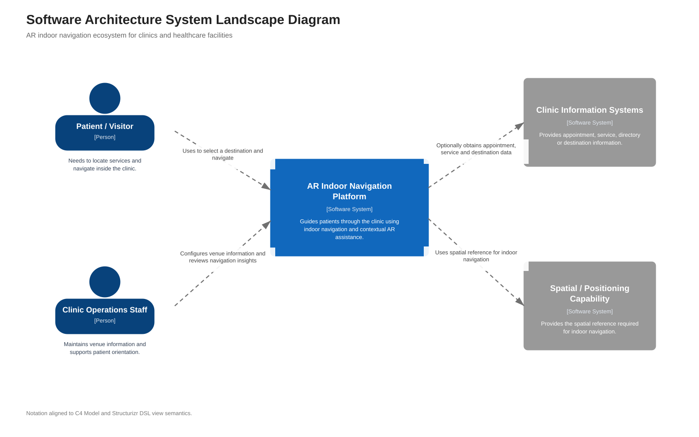
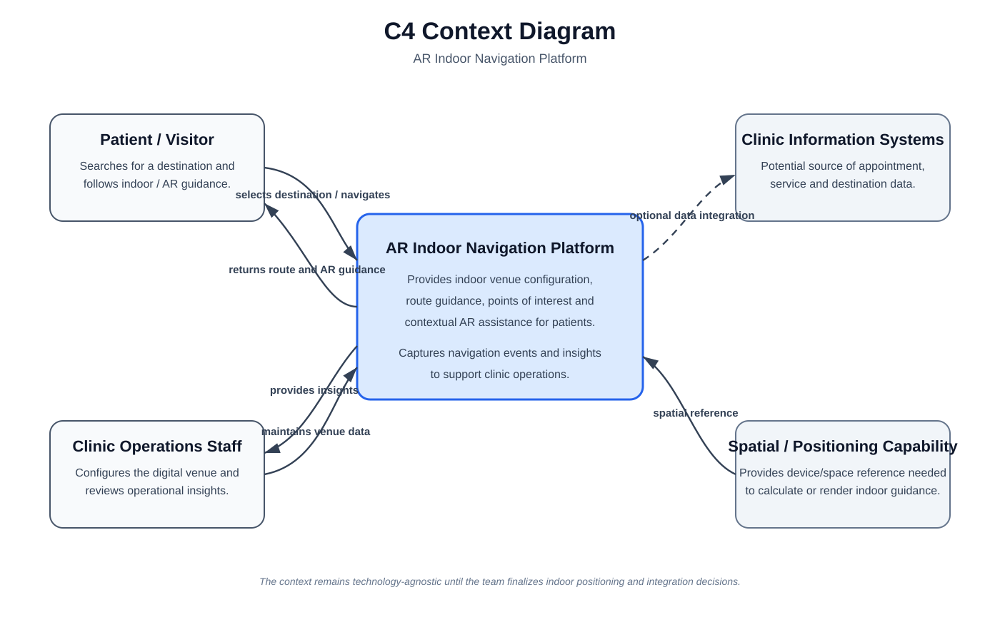

# Capítulo IV: Strategic-Level Software Design

## 4.1. Strategic-Level Attribute-Driven Design

*Qué debe ir: Evidenciar el proceso de Attribute-Driven Design de la solución. Incluir propósito, inputs, drivers arquitectónicos, decisiones de diseño y refinamiento de escenarios de atributos de calidad.*

### 4.1.1. Design Purpose

*Qué debe ir: Explicar el propósito del proceso de diseño, su relación con la problemática identificada y su orientación a las necesidades de los segmentos objetivo y del negocio.*

### 4.1.2. Attribute-Driven Design Inputs

*Qué debe ir: Introducir los tres tipos de input que se utilizarán en el proceso de diseño con ADD.*

#### 4.1.2.1. Primary Functionality (Primary User Stories)

*Qué debe ir: Seleccionar únicamente las Epics/User Stories con mayor relevancia funcional e impacto arquitectónico. Usar el cuadro de ID, título, descripción, criterios de aceptación y Epic relacionado; no duplicar todo el cuadro del capítulo de Requirements.*

#### 4.1.2.2. Quality attribute Scenarios

*Qué debe ir: Especificar la primera versión de los escenarios de atributos de calidad relevantes. Usar una fila por escenario con Atributo, Fuente, Estímulo, Artefacto, Entorno, Respuesta y Medida, asegurando que la medida sea cuantificable.*

#### 4.1.2.3. Constraints

*Qué debe ir: Especificar restricciones no negociables impuestas por el cliente o negocio. Introducirlas y luego representarlas como Technical Stories en un cuadro con ID, título, descripción, criterios de aceptación y Epic relacionado.*

### 4.1.3. Architectural Drivers Backlog

*Qué debe ir: Consolidar Functional Drivers, Quality Attribute Drivers y todos los Constraints acordados tras el Quality Attribute Workshop. Priorizar primero los drivers con alta importancia para stakeholders y alto impacto en Architecture Technical Complexity.*

### 4.1.4. Architectural Design Decisions

*Qué debe ir: Explicar el proceso por iteraciones del Quality Attribute Workshop: drivers considerados, tácticas/patrones evaluados y criterios de decisión. Complementar con Candidate Pattern Evaluation Matrix; si hay más de 3 patrones candidatos, mostrar los 3 más relevantes.*

### 4.1.5. Quality Attribute Scenario Refinements

*Qué debe ir: Presentar la versión final y priorizada de los escenarios refinados. Para cada escenario usar la estructura indicada: Scenario(s), Business Goals, Relevant Quality Attributes, Stimulus, Stimulus Source, Environment, Artifact, Response, Response Measure, Questions e Issues.*

## 4.2. Strategic-Level Domain-Driven Design

*Qué debe ir: Introducir y explicar el proceso de decisiones estratégicas aplicando Domain-Driven Design.*

### 4.2.1. EventStorming

*Qué debe ir: Explicar y evidenciar la sesión de EventStorming utilizada para modelar el dominio a alto nivel e identificar mayor detalle. Incluir capturas de la herramienta indicada y describir las actividades realizadas.*

### 4.2.2. Candidate Context Discovery

*Qué debe ir: A partir del EventStorm, explicar cómo se identificaron los candidate bounded contexts. El enunciado permite técnicas como start-with-value, start-with-simple o look-for-pivotal-events. Incluir capturas de la evolución del EventStorm.*

### 4.2.3. Domain Message Flows Modeling

*Qué debe ir: Explicar y evidenciar cómo colaboran los bounded contexts para resolver casos del negocio mediante Domain Storytelling. Incluir capturas de los diagramas elaborados.*

### 4.2.4. Bounded Context Canvases

*Qué debe ir: Diseñar los candidate bounded contexts por orden de importancia mediante Bounded Context Canvas. Documentar el proceso iterativo: Context Overview Definition, Business Rules Distillation & Ubiquitous Language Capture, Capability Analysis, Capability Layering (si aplica), Dependencies Capture y Design Critique.*

### 4.2.5. Context Mapping

*Qué debe ir: Explicar y evidenciar alternativas de context maps y su discusión hasta llegar a la mejor aproximación. Considerar patrones de relación DDD como Anti-corruption Layer, Conformist, Customer/Supplier o Shared Kernel.*

## 4.3. Software Architecture

La arquitectura de la solución se documenta mediante **C4 Model utilizando Structurizr**, siguiendo la semántica oficial del DSL y las vistas disponibles en **Structurizr Playground**. El modelo arquitectónico se define como una fuente única y consistente, mientras que en el Project Report se incluyen únicamente las imágenes exportadas de las vistas correspondientes; el código DSL no forma parte del informe.

De acuerdo con la documentación oficial de Structurizr, la vista **System Landscape** permite mostrar personas y software systems dentro del ecosistema general, mientras que la vista **System Context** se centra en un software system concreto y muestra las personas y sistemas directamente relacionados con él. Ambas vistas se han planteado con claves estables y relaciones explícitas, manteniendo el modelo independiente de decisiones tecnológicas que todavía no han sido cerradas.

Las vistas describen el alcance conceptual actual del producto: una plataforma B2B para clínicas y establecimientos de salud que permite configurar un espacio indoor y asistir a pacientes o visitantes durante su recorrido mediante navegación contextual y realidad aumentada. En esta etapa se evita fijar prematuramente un proveedor o tecnología específica de posicionamiento indoor; esa decisión deberá desprenderse posteriormente de los architectural drivers, restricciones y quality attributes.

### 4.3.1. Software Architecture System Landscape Diagram

El **Software Architecture System Landscape Diagram** muestra el ecosistema de alto nivel asociado a la propuesta. El sistema de interés es la **AR Indoor Navigation Platform**, utilizada por pacientes o visitantes y administrada por personal operativo de la clínica. El landscape incorpora además los sistemas externos relevantes para comprender el contexto global sin bajar todavía al detalle de containers o componentes.

La vista fue modelada siguiendo la definición `systemLandscape` de Structurizr, donde se incluyen las personas y software systems relevantes y sus relaciones. La imagen incluida en el informe corresponde a la representación visual del modelo y no expone el código DSL utilizado para construirla.

**Elementos principales del landscape:**

- **Patient / Visitor:** persona que necesita localizar servicios y navegar dentro de la clínica.
- **Clinic Operations Staff:** personal administrativo u operativo que mantiene información del establecimiento y participa en la gestión de la orientación del paciente.
- **AR Indoor Navigation Platform:** software system desarrollado por el equipo para brindar navegación indoor y asistencia contextual mediante AR.
- **Clinic Information Systems:** software systems externos que pueden proporcionar información de citas, servicios, directorios o destinos cuando se definan integraciones.
- **Spatial / Positioning Capability:** software system o capacidad externa que proporciona la referencia espacial necesaria para la navegación indoor.

La tecnología concreta utilizada para posicionamiento se mantiene intencionalmente abstracta. Esto evita convertir una alternativa todavía no evaluada en una decisión arquitectónica definitiva y permite que el diseño evolucione después del análisis de drivers.

### 4.3.2. Software Architecture Context Level Diagrams

El **Software Architecture Context Level Diagram** representa la vista `systemContext` de Structurizr para la **AR Indoor Navigation Platform**. Según la definición oficial de esta vista, el software system de interés se presenta junto con las personas y software systems que mantienen una relación directa con él.

Este nivel muestra el límite del sistema sin introducir aplicaciones internas, bases de datos, APIs o componentes. El detalle de dichas responsabilidades se desarrollará posteriormente en el Container Diagram y en el Tactical-Level Software Design.

Desde la perspectiva del paciente o visitante, la plataforma permite seleccionar un destino y recibir indicaciones durante el recorrido. Desde la perspectiva del personal operativo, permite mantener información del venue y revisar datos asociados al uso de la navegación. La solución puede relacionarse con sistemas de información de la clínica para obtener datos relevantes y necesita una capacidad de posicionamiento o referencia espacial para determinar la ubicación del usuario dentro del establecimiento.

La vista permanece deliberadamente **technology-agnostic** respecto al mecanismo de positioning. El objetivo de este nivel es establecer correctamente actores, sistemas externos, límites y relaciones; las decisiones tecnológicas deben justificarse en los niveles posteriores del proceso arquitectónico.

### 4.3.3. Software Architecture Container Level Diagrams

*Qué debe ir: Presentar y explicar el Container Diagram, mostrando elementos de alto nivel, distribución de responsabilidades, principales decisiones tecnológicas y comunicación entre containers.*

### 4.3.4. Software Architecture Deployment Diagrams

*Qué debe ir: Incluir los diagramas de despliegue indicados en la estructura. El enunciado también exige el Deployment Diagram de C4 Model dentro de Software Deployment Configuration (7.1.4).*
